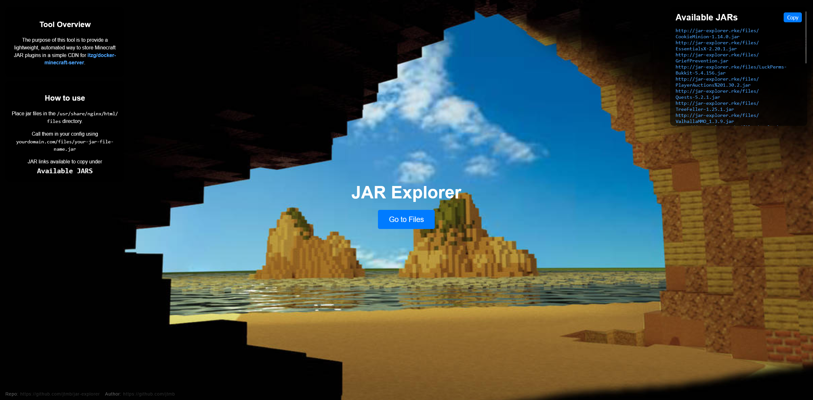

<h1 align="center">
  <a href="https://github.com/jtmb">
    
  </a>
</h1>

<div align="center">
  <b>JAR Explorer</b> - A lightweight JAR CDN. 
  <br />
  <br />
  <a href="https://github.com/jtmb/jar-explorer/issues/new?assignees=&labels=bug&title=bug%3A+">Report a Bug</a>
  ·
  <a href="https://github.com/jtmb/jar-explorer/issues/new?assignees=&labels=enhancement&template=02_FEATURE_REQUEST.md&title=feat%3A+">Request a Feature</a>
  .
  <a href="https://hub.docker.com/repository/docker/jtmb92/jar-explorer/general">Docker Hub</a>
</div>
<br>
<details open="open">
<summary>Table of Contents</summary>

- [About](#about)
- [Prerequisites](#prerequisites)
- [Getting Started](#getting-started)
    - [Docker Image](#docker-image)
    - [Running on Docker Compose](#running-on-docker-compose)
    - [How to Use](#how-to-use)
- [License](#license)

</details>

<br>

---

### <h1>About </h1>

The purpose of this tool is to provide a light weight, automated way to store Minecraft JAR plugins in some form of a "CDN" so it may be called by <a href="https://docker-minecraft-server.readthedocs.io/en/latest/mods-and-plugins/#modplugin-url-listing-file" target="_blank">itzg/docker-minecraft-server</a>.

---




### <h2>Getting Started</h2>
### [Docker Image](https://hub.docker.com/r/jtmb92/jar-explorer)
```docker
 docker pull jtmb92/jar-explorer
```
### Running on Docker Compose  
Run on Docker Compose (this is the recommended way) by running the command "docker compose up -d".  
```yaml
---
services:
  jar-explorer:
    image: jtmb92/jar-explorer:latest
    ports:
      - "8080:80"
    volumes:
     - /path/to/your/jar/folder:/usr/share/nginx/html/files
```

### How to Use
1. Place jar files in the `/usr/share/nginx/html/files</code> directory`
2. Call jar files in your config using `yourdomain.com/files/your-jar-file-name.jar`


## License

This project is licensed under the **GNU GENERAL PUBLIC LICENSE v3**. Feel free to edit and distribute this template as you like.

See [LICENSE](LICENSE) for more information.